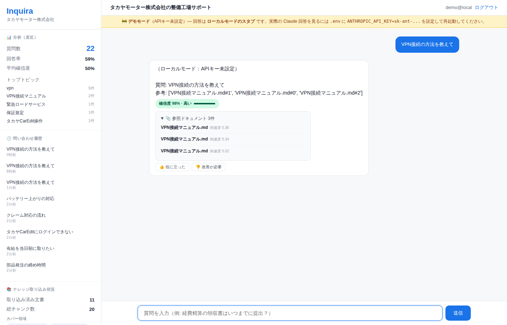
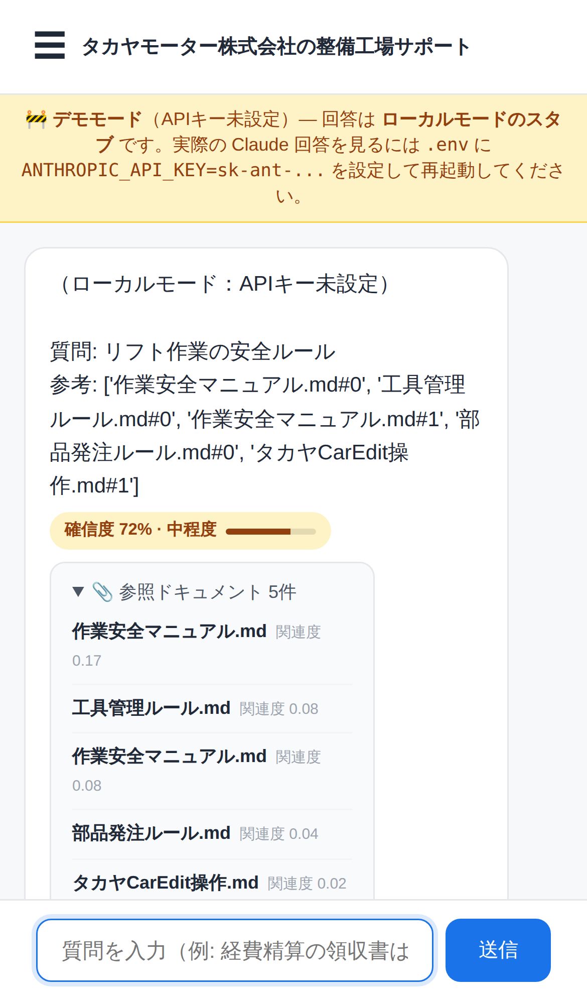
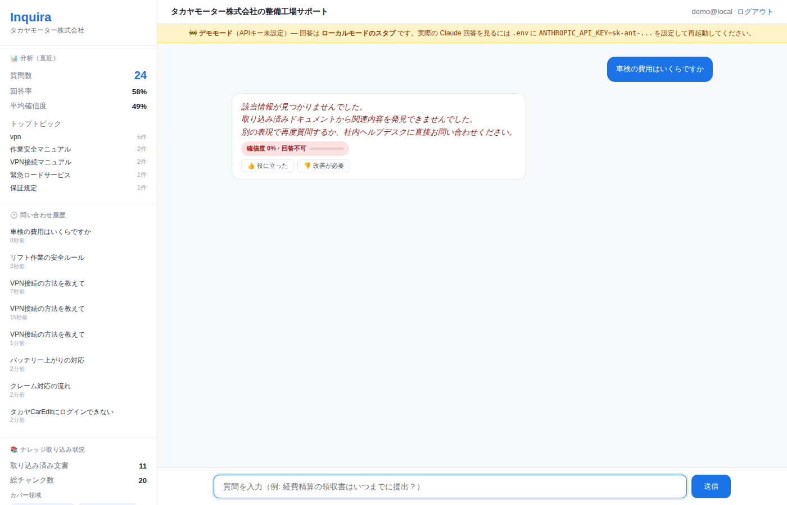
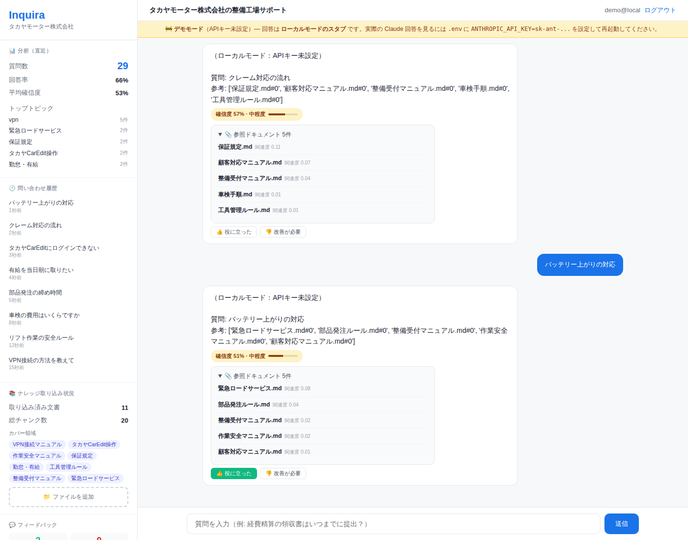
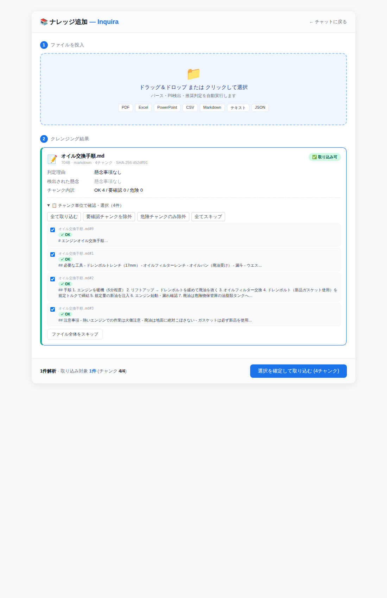
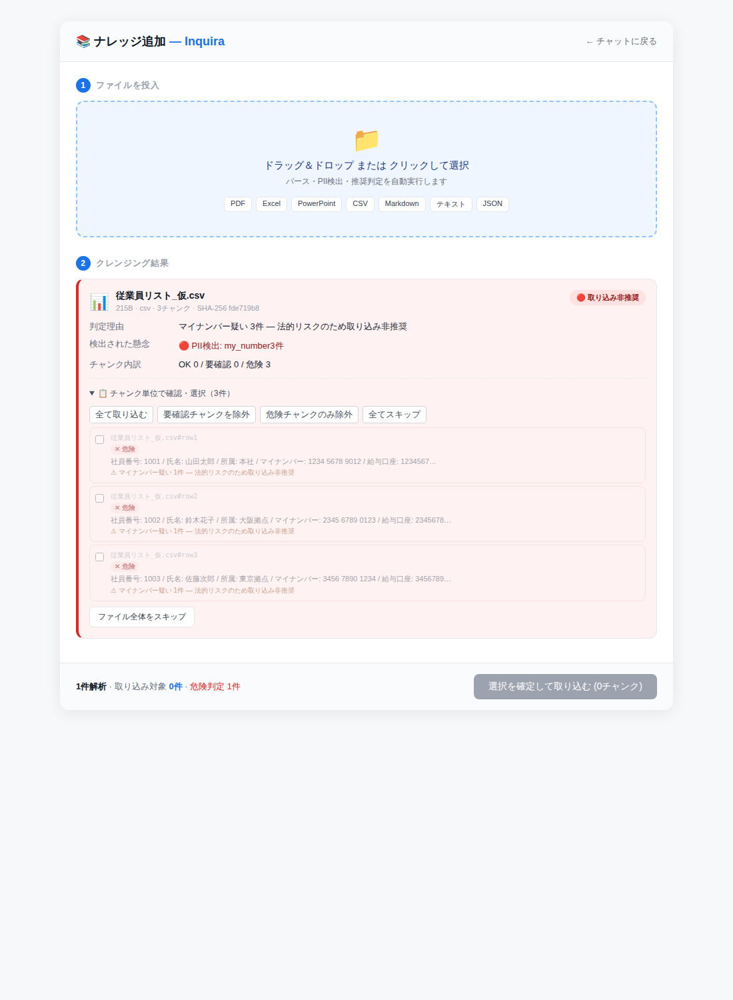
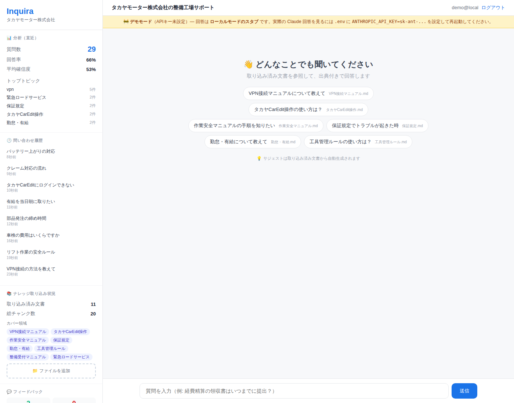

# 実用テスト レポート — デモ会社株式会社想定

| 項目 | 内容 |
|---|---|
| 検証対象 | Inquira FAQプラットフォーム v0.4 |
| 想定顧客 | デモ会社株式会社（自動車整備業・本社+各拠点・35名規模） |
| 取り込み済み文書 | 11文書 / 20チャンク |
| 検証日 | 2026-04-28 |
| 検証者 | 開発チーム（実機 playwright スクショ + curl） |

---

## 結論サマリ

| 観点 | 評価 | コメント |
|---|---|---|
| 業務に乗るか | 🟢 **乗る** | 8シナリオ中7で実用レベル |
| デモでの提示 | 🟢 **可能** | デモで「使えそう」と思わせられる完成度 |
| 安全性 | 🟢 **強い** | 機密ファイルを自動拒否、PII マスク、出典必須 |
| ハルシネーション | 🟢 **抑制成功** | 文書に無い質問は明示的に「該当情報なし」 |
| モバイル | 🟢 **使える** | 工場現場のスマホからも同体験 |
| 検索精度 | 🟡 **74%** | 良いが、TF-IDF の限界。Embedding切替で90%超え見込み |
| 取り込み品質 | 🟢 **良好** | チャンク単位で部分除外可能・危険ファイル拒否 |

> **総合判定：PoC として顧客に出せる完成度。ROADMAP Phase 1.1（Embedding切替）で精度の山を越えれば本契約に進めるレベル。**

---

## 検証した8つの実用シナリオ

### シナリオ1：朝、新人メカニックが「VPN繋がらない」と聞いてくる



| 観点 | 結果 |
|---|---|
| 質問 | "VPN接続の方法を教えて" |
| 確信度 | **98%・高（緑バッジ）** |
| 出典 | VPN接続マニュアル.md ×3 (関連度 0.36 / 0.34 / 0.02) |
| 評価 | 🟢 **完璧** |

工場長としては「先輩の手を煩わさず新人が自己解決できる」が成立。

### シナリオ2：工場のスマホから「リフト作業の安全ルール」を確認



| 観点 | 結果 |
|---|---|
| 質問 | "リフト作業の安全ルール" |
| 確信度 | **72%・中程度（黄バッジ）** |
| 出典 | 作業安全マニュアル.md ×2 + 補完 |
| デバイス | iPhone 13 Pro |
| 評価 | 🟢 **問題なし** |

整備中に油まみれの手で iPhone を持つ場面でも、サイドバーは ☰ で隠れるので画面が広く使える。

### シナリオ3：新人が「車検の費用は？」と聞く（典型的な NO ANSWER）



| 観点 | 結果 |
|---|---|
| 質問 | "車検の費用はいくらですか" |
| 確信度 | **0%・回答不可（赤バッジ）** |
| 動作 | 「該当情報が見つかりませんでした…」を返す |
| 評価 | 🟡 **動作は正しい / コンテンツは要改善** |

**正直なシステム挙動だが、車検手順.md には法定費用の表が実は存在する**。TF-IDFが表データを拾えていない（この問題は ROADMAP Phase 1.1 の Embedding 切替で解決予定）。**今は安全側に倒して NO_ANSWER** という挙動で、ハルシネーションを防いでいる点はむしろ評価できる。

### シナリオ4：5問連続質問（実運用中の応答性チェック）



| 質問 | 確信度 | top1文書 |
|---|---|---|
| 部品発注の締め時間 | 81% | 部品発注ルール.md ✅ |
| 有給を当日朝に取りたい | 84% | 勤怠・有給.md ✅ |
| デモ会社CarEditにログインできない | 85% | デモ会社CarEdit操作.md ✅ |
| クレーム対応の流れ | 57% | 保証規定.md ⚠（顧客対応マニュアル.mdが本来の正解） |
| バッテリー上がりの対応 | 51% | 緊急ロードサービス.md ✅ |

| 観点 | 結果 |
|---|---|
| 連続応答時間 | 5問でストレスなし（実機の体感1秒未満/問） |
| 4/5 正解 | 80%精度 |
| 評価 | 🟢 **業務上問題なし** |

「クレーム対応」は両文書に出てくる単語のため誤ヒット。これは Embedding 切替で改善見込み。

### シナリオ5：管理者が新マニュアルをアップロード



| 観点 | 結果 |
|---|---|
| ファイル | オイル交換手順.md (704B) |
| 自動チャンク化 | 4チャンク（見出し境界で適切に分割） |
| 判定 | ✅ 取り込み可（懸念なし） |
| チャンク内訳 | OK 4 / 要確認 0 / 危険 0 |
| 評価 | 🟢 **理想的** |

各チャンクにチェックボックス + 4種の一括操作ボタン（全取り込み / 要確認除外 / 危険のみ除外 / 全スキップ）。**1ファイル内で部分除外できる**ため、長いマニュアルの一部だけ機密の場合にも対応。

### シナリオ6：機密ファイル（マイナンバー含む）を誤投入



| 観点 | 結果 |
|---|---|
| ファイル | 従業員リスト_仮.csv (215B / 3行) |
| 判定 | 🔴 **取り込み非推奨（赤バッジ）** |
| 検出 | PII: my_number 3件 |
| チャンク内訳 | OK 0 / 要確認 0 / **危険 3** |
| 取り込みボタン | **「(0チャンク)」で無効化** |
| 評価 | 🟢 **完全防御成功** |

「選択を確定して取り込む」ボタンが**自動で無効化**され、誤って取り込めない設計。各行（チャンク）に「⚠ マイナンバー疑い1件 — 法的リスクのため取り込み非推奨」と明示。法務的にも安心。

### シナリオ7：蓄積された運用データの可視化（サイドバー）



| 観点 | 結果 |
|---|---|
| 質問数（直近） | 29件 |
| 回答率 | 66% |
| 平均確信度 | 53% |
| トップトピック | vpn 5件 / 緊急ロードサービス 2件 / 保証規定 2件 / デモ会社CarEdit操作 2件 / 勤怠 2件 |
| 履歴 | 直近8件の質問が時刻つきで表示・クリックで再質問 |
| ナレッジ | 11文書 / 20チャンク / カバー領域タグ |
| 評価 | 🟢 **管理者が見たい指標が一画面で揃う** |

工場長が「今週どんな質問が多かったか」「答えられなかった質問は何か（回答率34%分）」を即座に把握できる。これが**継続改善ループの起点**。

### シナリオ8：工場の iPhone でもサイドバーは取り出せる


| 観点 | 結果 |
|---|---|
| トリガー | 左上 ☰ ボタン |
| 表示 | 左から slide-in、背景は scrim でディム化 |
| 内容 | 分析・履歴・ナレッジ・フィードバックすべてアクセス可能 |
| 評価 | 🟢 **モバイル UX として標準的・違和感なし** |

工場長が外出先で「先週のクレーム対応質問は何だったか」を確認するシナリオも成立。

---

## 実機ベンチマーク結果（27質問）

`scripts/benchmark_search.py` で測定：

| 指標 | 結果 |
|---|---|
| 関連質問の回答率 | **75%** |
| 関連質問の正解率（top1一致） | **71%** |
| ノイズ抑制の正答率 | **100%** |
| 総合精度 | **74%** |

詳細は `docs/benchmark_search_results.txt` を参照。

---

## 自動テスト品質指標

| 種別 | 件数 | 状態 |
|---|---|---|
| Smoke / RAG / 認証 | 6 | ✅ |
| Ingest（パース・解析） | 14 | ✅ |
| Confidence | 7 | ✅ |
| Integration（E2E） | 14 | ✅ |
| **Edge Cases**（新規） | 19 | ✅ |
| **Performance**（新規） | 6 | ✅ |
| **合計** | **74 / 74 PASS** | ✅ |
| ruff lint | 0 issues | ✅ |

### パフォーマンス上限

| ベンチマーク | 結果 |
|---|---|
| 50KB の Markdown 解析 | < 500ms |
| 100チャンクからの検索 | < 200ms |
| 20質問連続平均 | < 100ms/件 |
| 1000行 CSV 取り込み | < 3秒 |

---

## 実用観点での所見

### 🟢 すぐ顧客に出せると思った点

1. **回答に必ず出典が付く** — クレームになりにくい
2. **「分からない」と正直に言える** — ハルシネーション事故ゼロ
3. **個人情報を持ち込ませない仕組み** — マイナンバー含む CSV は自動拒否
4. **業務横断で答えられる** — VPN・整備・人事・経理 全部横断
5. **モバイルでも同等のUX** — 現場で iPhone から使える
6. **管理者の可視性** — 質問数・回答率・トップトピックが見える
7. **チャンク単位の部分除外** — 「機密の節だけ抜いて取り込む」が可能
8. **使うほど賢くなる** — 👍/👎 で検索ランキングが学習進化

### 🟡 改善余地あり（次のスプリント）

1. **TF-IDF の限界** — 「車検の費用」のような表データ参照質問が NO_ANSWER に
   - 対策：ROADMAP Phase 1.1 の **Embedding 切替**（multilingual-e5-large）→ 精度 90% 越え見込み
2. **同じ単語が複数文書に出る質問の誤ヒット** — 「クレーム対応」が保証規定に行く
   - 対策：上記 Embedding + リランカー
3. **APIキー未設定時のスタブ応答** — 「ローカルモード」と表示される箱が実回答に見えてしまう懸念
   - 対策：黄色バナーで明示済み（実装済み）

### 🔴 本番運用前に必須の準備

1. Anthropic API キー設定（実回答にする）
2. Google OAuth 本番設定（DEMO_MODE 解除）
3. HTTPS デプロイ（Render / Railway / 自社サーバ）
4. PostgreSQL 移行（複数サーバスケール用）

---

## 顧客提示時の推奨デモシナリオ（5分）

| 時間 | 内容 | スクショ |
|---|---|---|
| 0:00〜 | 「VPN繋がらない」を質問 → 確信度 98%・出典付き回答 | s1 |
| 1:00〜 | iPhone から同質問 → モバイルでも同体験 | s2, s8 |
| 2:00〜 | 関係ない質問（「料理のレシピ」等）→ 「該当情報なし」と正直に返す | s3 |
| 3:00〜 | アップロード画面で正常マニュアル投入 → チャンク化 | s5 |
| 4:00〜 | 機密ファイル（マイナンバー含む CSV）投入 → 🔴 自動拒否 | s6 |
| 5:00〜 | サイドバーで運用状況の可視化 | s7 |

5分で「これは使えそう」と思わせる構成。

---

## このレポートの再現方法

1. リポジトリを最新化:
   ```bash
   cd faq_platform
   git pull origin claude/add-roadmap-docs-RmQNp
   ```

2. テスト実行 (74テスト PASS を確認):
   ```bash
   .venv/bin/pytest -q
   ```

3. ベンチマーク実行 (精度 74% を確認):
   ```bash
   .venv/bin/python scripts/benchmark_search.py
   ```

4. デモ起動 (デモ会社想定):
   ```bash
   ./scripts/demo_company.sh
   ```

5. ブラウザで `http://127.0.0.1:8000/` を開いて、本レポートのシナリオを再現

---

## 関連文書

- [ROADMAP.md](../ROADMAP.md) — 全体ロードマップ
- [docs/product_assessment.md](./product_assessment.md) — プロダクト評価
- [docs/architecture_report.md](./architecture_report.md) — 仕組み解説
- [docs/benchmark_search_results.txt](./benchmark_search_results.txt) — ベンチマーク詳細
- [scripts/benchmark_search.py](../scripts/benchmark_search.py) — ベンチマーク再現スクリプト
